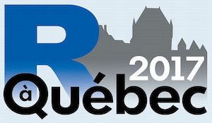

## Présentation

[R à Québec 2017](http://raquebec.ulaval.ca/2017/) est le premier
grand colloque annuel interdisciplinaire et francophone dédié à
[R](https://www.r-project.org) en Amérique du Nord.

L'atelier *Introduction à R*, offert en marge du colloque, s'adresse
aux personnes désirant s’initier à R. Il est divisé en deux grandes
parties: un exposé des concepts de base permettant de comprendre les
fondements du **langage de programmation** R; une mise en situation
permettant de découvrir quelques unes des nombreuses fonctionnalités
de l'**environnement statistique**. Dans les deux cas, l'accent est
mis sur la pratique.

## Version

1.1 ([nouveautés]({{ site.github.repository_url }}/releases/tag/v1.1/))

## Thèmes abordés

- Présentation générale de R.
- Interfaces et stratégies de travail.
- Aide et documentation.
- Bases du langage R, notamment l'arithmétique vectorielle.
- Fonctions.
- Différents types de données.
- Fonctions d'application.
- Structures de contrôle.
- Extensions pas le biais de paquetages.
- Importation et manipulation de jeux de données.
- Création et annotation de graphiques.
- Procédures statistiques standards.

## Pré-requis pour la formation

Aucune expérience avec R n’est requise pour la formation. Toutefois,
Les participants doivent au préalable installer sur leur poste de
travail:

- la plus récente version de [R](https://cran.r-project.org/);
- la plus récente version de [RStudio Desktop](https://www.rstudio.com/products/rstudio/download/#download); 
- la [documentation]({{ site.github.releases_url }}/download/v1.1/raquebec-atelier-introduction-r.zip) de la formation (décompresser l'archive `.zip` dans un dossier quelconque).

## Auteurs et animateurs

- [Vincent Goulet](https://vgoulet.act.ulaval.ca/), professeur titulaire, [École d'actuariat](https://wwwéactéulaval.ca) de l'[Université Laval](https://ulaval.ca).
- David Beauchemin, étudiant au baccalauréat en actuariat à l'Université Laval.
- Samuel Cabral Cruz, analyste en actuariat chez Desjardins Assurances Générales et étudiant au baccalauréat en génie lociciel à l'Université Laval.

